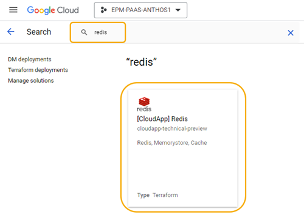
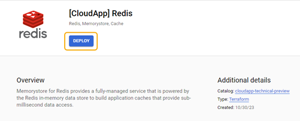
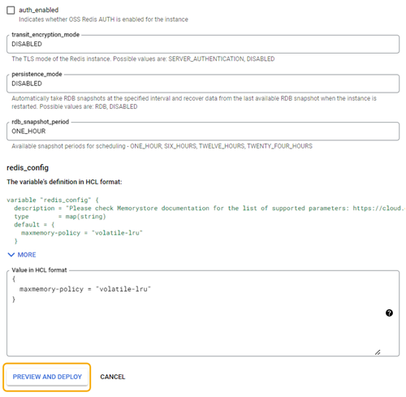
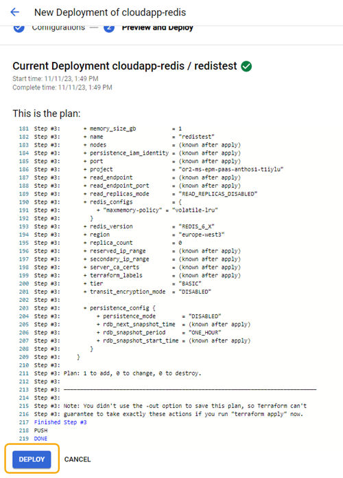
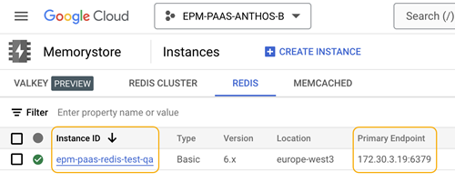
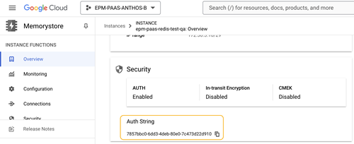
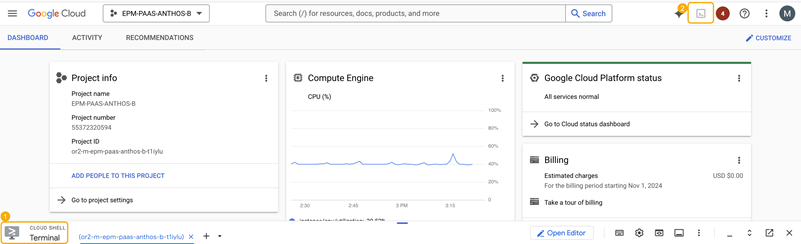
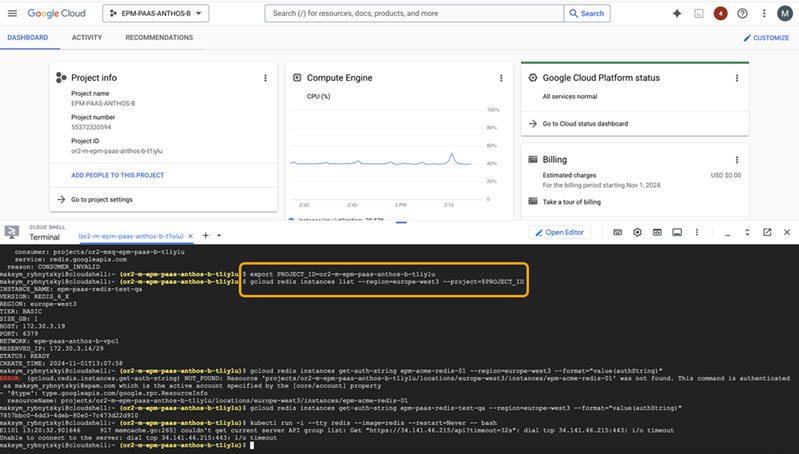

# Get started with Redis

## Contents
- [Overview](#overview)
- [Deploy Redis from Service Catalog](#deploy-redis-from-service-catalog)
- [Check the information about the Redis connection in Google Cloud Console](#check-the-information-about-the-redis-connection-in-google-cloud-console)
- [Check the information about the Redis connection via Cloud Shell Terminal and gcloud CLI](#check-the-information-about-the-redis-connection-via-cloud-shell-terminal-and-gcloud-cli)
- [Test the Redis connection](#test-the-redis-connection)
- [Update and deprovision a Terraform deployment](#update-and-deprovision-a-terraform-deployment)
- [Useful resources](#useful-resources)

## Overview
Memorystore for Redis provides a fully-managed service powered by the Redis in-memory data store to build application caches that provide sub-millisecond data access.

The solution from Service Catalog provides an additional private network configuration.

## Deploy Redis from Service Catalog
You can get started with Redis after deploying it from Service Catalog of [Google Cloud Console](https://console.cloud.google.com/getting-started).<br><br>
To deploy Redis:
1. Go to Google Cloud Console.
2. Sign in with your EPAM account credentials (*Your_Name@epam.com*), and then select your project.
3. In the search box, type **Redis**, and then select **[CloudApp] Redis**.<br>

4. Select **Deploy**.<br>

5. Configure the deployment parameters, and then select **Preview and Deploy**.<br>
>[Redis AUTH](https://cloud.google.com/memorystore/docs/redis/about-redis-auth) (auth_enabled) must always be enabled for the Service Catalog solution due to security risks in shared VPC.<br>

<br>
The table includes a full list of all parameters available at this stage.

| Parameter | Description | Example |
| --------- | ----------- | ------- | 
| **Deployment name** | Readable unique name for Redis deployment. | epm-acme-redis-01 |
| **instance_id** | The name of your Redis instance. | epm-acme-redis-01 |
| **network_project_id**| The project ID of VPC where to create the instance:<br> - On the [landing page](https://console.cloud.google.com/welcome), you can find your project ID.<br> - Shared VPC can be shared with your project. See [shared networks](https://console.cloud.google.com/networking/networks/list?pageTab=SHARED_SUBNETS).||
| **vpc_name**| The VPC name to create the instance within the selected project: <br> - On [VPC menu](https://console.cloud.google.com/networking/networks/list), you can find the VPC name.<br> - Shared VPC can be shared with your project. See [shared networks](https://console.cloud.google.com/networking/networks/list?pageTab=SHARED_SUBNETS).||
| **tier** | Determines availability, cost, and performance.<br> Possible values: BASIC, STANDARD_HA.<br> - The basic tier (BASIC) has lower cost and doesn't provide high availability.<br> - The standard tier (STANDARD_HA) supports automatic failover for high availability and up to five read replicas for scaling reads.| BASIC |
| **memory_size_gb** | Redis memory size in gigabytes.| 1 |
| **replica_count** | Read replica mode: READ_REPLICAS_DISABLED or READ_REPLICAS_ENABLED.<br> Can only be specified when trying to create an instance. If disabled, the read endpoint won't be provided, and the instance cannot change the number of replicas. | READ_REPLICAS_DISABLED |
| **redis_version** | The version of Redis software. Possible values: REDIS_6_X, REDIS_7_0. | REDIS_6_X |
| **transit_encryption_mode** | The TLS mode of the Redis instance.<br> Possible values: SERVER_AUTHENTICATION, DISABLED.| DISABLED |
| **persistence_mode**| Automatically takes RDB snapshots at the specified interval and recovers data from the last available RDB snapshot when the instance is restarted.<br> Possible values: RDB, DISABLED.| DISABLED|
|**rdb_snapshot_period**|Available snapshot periods for scheduling: ONE_HOUR, SIX_HOURS, TWELVE_HOURS, TWENTY_FOUR_HOURS. | ONE_HOUR|
|**redis_config**|Memorystore documentation for the [list of supported parameters](https://cloud.google.com/memorystore/docs/redis/reference/rest/v1/projects.locations.instances#Instance.FIELDS.redis_configs).|{<br>maxmemory-policy = "volatile-lru"<br>}|

6. Select **Deploy**, and then wait until the deployment finishes.<br>

7. Validate Redis availability via one of the following:<br>
- Google Cloud Console.
- Cloud Shell Terminal and gcloud CLI.

## Check the information about the Redis connection via Google Cloud Console
To check the information about the Redis connection via [Google Cloud Console](https://console.cloud.google.com/getting-started):<br>
1. Go to Google Cloud Console.
2. On **Navigation menu** , go to **Memorystore**. Here you can see **Instance ID** and **Primary Endpoint**.<br>

3. Select the name of the created instance. After this, you can get the authentication string under **Auth String**. Save it for future use.<br>


## Check the information about the Redis connection via Cloud Shell Terminal and gcloud CLI
To check the information about the Redis connection via [Cloud Shell Terminal](https://cloud.google.com/shell/docs/launching-cloud-shell) and [gcloud CLI](https://cloud.google.com/sdk/docs/install-sdk):<br>
1. In **Dashboard**, select **Cloud Shell Terminal** (1) and **Activate Cloud Shell**  (2).<br>

2. Run the export `PROJECT_ID` and `gcloud redis instances list` commands as follows:<br>

```
export PROJECT_ID=or2-msq-epm-paas-b-t1iylu
```

```
gcloud redis instances list --region=europe-west3 --project=$PROJECT_ID
```
<br>

3. Note the information about **HOST**, **PORT**, and **INSTANCE NAME** instead of **Primary Endpoint**, **Location**, and **Instance ID**.

```
INSTANCE_NAME      VERSION    REGION        TIER         SIZE_GB  HOST            PORT  NETWORK                   RESERVED_IP       STATUS  CREATE_TIME
epm-acme-redis-01  REDIS_7_0  europe-west3  STANDARD_HA  1        100.100.250.12  6379  epm-paas-poc-shared-vpc1  100.100.250.8/29  READY   2023-10-27T11:46:27
```

4. Get the authentication string of the created instance as follows:<br>

```
gcloud redis instances get-auth-string epm-acme-redis-01 --region=europe-west3 --format="value(authString)"
```

## Test the Redis connection 
**Prerequisites**<br>
- A Kubernetes cluster.
- Proper configuration of your kubectl to work with your Kubernetes cluster.
- The primary endpoint configured like Host:Port.<br>

To test the Redis connection:<br>
1. Connect from the GKE cluster in the same VPC with the saved `HOST` and `authString` value, and then run a Redis container.
2. Run the `redis-cli` command, and then use the `HOST` value from the created instance.<br>

```
redis-cli -h 100.100.250.12 -a 09b28ca2-85ac-4bfe-9e14-abc1871445b9
```
3. Get the instance with the **info** command.<br>

```
info
Server redis_version:7.0.12
redis_git_sha1:00000000
redis_git_dirty:0
redis_build_id:d34a72c39ad5196e
redis_mode:standalone
...

```
4. Exit the instance and the Redis container.<br>

```
exit
```

Now, Redis is ready to use.

## Update and deprovision a Terraform deployment
- For more information on updating a Terraform deployment, see the [official Google documentation](https://cloud.google.com/service-catalog/docs/view-and-launch#update_terraform).
- For more information on deprovisioning a Terraform deployment, see the [official Google documentation](https://cloud.google.com/service-catalog/docs/view-and-launch#deprovision_a_terraform_deployment).

## Useful resources
- [Memorystore for Redis official documentation](https://cloud.google.com/memorystore/docs/redis)
- [Redis documentation](https://redis.io/docs/)
